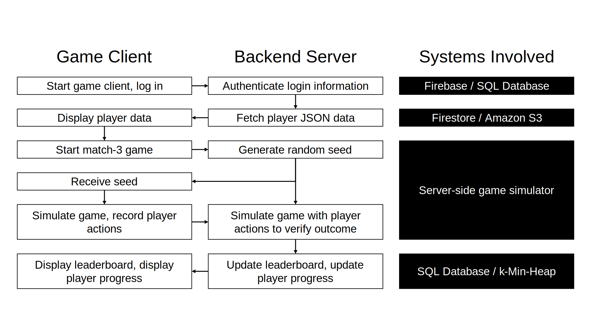

# Technical Screen for Happy Hour Games

## Q1: Energy System

I have attempted this in C#. The function required is really just as follows:

```c#
private int energy;
private DateTime lastUpdateTimeStamp;
private TimeSpan timeStored; // To store "overflowed" time if the database isn't updated in multiples of 30 min.

public int GetEnergy()
{
    timeStored += CurrentTime - lastUpdateTimeStamp;
    var deltaEnergy = (int)(timeStored.Ticks / TimeForOneEnergy.Ticks); // Amount of energy to add.
    timeStored -= deltaEnergy * TimeForOneEnergy; // Remainder amount of time.

    energy = Math.Min(MaxEnergy, energy + deltaEnergy); // Clamp energy to MaxEnergy.
    if (energy == MaxEnergy) timeStored = TimeSpan.Zero; // If at max energy, cannot store extra time.
    lastUpdateTimeStamp = CurrentTime;

    return energy;
}
```

This function is part of an `EnergyManager` class. `CurrentTime` is a property of type `DateTime`; `TimeForOneEnergy` is of type `TimeSpan`; `MaxEnergy` is of type `int`. It turns out that it's not enough to store the last updated timestamp and compute the missing amount of energy. Consider the following scenario:

1. Player starts with 2 Energy at time 0, and assume energy was last updated at time 0.
2. At time 45, player checks energy. Energy updates to 3 Energy; energy last update is now set to time 45.
3. At time 60, player checks energy. If `timeStored` isn't used, energy does __not__ update to 4 because it has only been 15 minutes since the previous update.

Hence, `timeStored` is used to keep track of overflowed time to make sure the player gets energy fairly.

In this repository, I have mocked up a [simple database](HappyHourTechnicalScreen/EnergyDatabase.cs) using a `Dictionary` keyed by `playerId` that further simulates the environment that this function might be used. The code has also been [unit-tested](HappyHourTechnicalScreen/EnergyDatabaseTests.cs) using the NUnit constraint model (unit tests are in this repository as well).

Some main assumptions I made about the behaviour of this system:
1. There's a realistic driver providing the `CurrentTime` value, and it will always provide values that doesn't cause `deltaEnergy` to overflow. In my test environment, I have it such that I can manually adjust it.
2. The energy for a new player is initialized to be max.

## Q2: CI/CD Pipeline

Designing a CI/CD Pipeline starts with designing the CI. First of all, we decide on a DevOps platform. Personally, I'm used to using GitLab for my game development so let's use that. I'm also going to tailor my response to a CI/CD pipeline for a game project. For simplicity, I'll just describe the broad strokes. The CI/CD will have 3 stages:

**1. Testing & Static Analysis**

In this stage, we will run the test for the project. Namely, we need:
* Unit tests to check component functionality;
* Integration tests to make sure our parts work together;
* Regression tests to detect reappearing bugs;
* Data serialization/deserialization tests, especially if the game is data-driven;
* Some unit performance tests, which are important in the context of games.

Note that this involves having already written comprehensive tests for the critical features in the project. Without comprehensive tests, it's risky to do CI/CD since the CD can be a "success" and yet have catastrophic failures.

We will also run some static analysis, e.g. linting for code style and quality checks, and security scans for vulnerabilities. I'm not super familiar with static analysis but other important analyzers can be added here.

**2. Building**

The building process in this step depends on the platform. For Unity, we'll have to make standalone builds for each of our target platforms (e.g. Android, iOS, PC, Mac). We can add build validation scripts to this step as well, to make sure the build contains the expected files and doesn't have any broken/missing assets or broken references.

**3. Deploying**

Now that the game has been built, it can be uploaded to a test environment for testers and QA. We will also have automated tests in this test environment:
* For Unity, I haven't tried it yet but I believe Play Mode tests can be set up to test builds.
* Smoke tests can check if the build correctly starts up etc.
* Network (and multiplayer tests for games) can be automated as well if required.
* Performance tests, e.g. frame rate, memory usage etc.
* UI tests can be automated with frameworks like the [Unity UI Test Automation Framework](https://github.com/taphos/unity-uitest).

## Q3: Backend Infrastructure
My design for backend infrastructure depends on the budget, because a lot of components I will describe will be nice to have, but will also incur server costs or software license costs. Admittedly, I've only developed offline games so all my experience designing backend infrastructure is for local storage and data-driven game engines. 

1. Since this will be a match-3 online game, I will use a Model-View-Controller pattern, where the model and controller are server-side; the controller will be the client. To prevent cheating, we need to have verification for stage clearing. I suppose this can be achieved by keeping track of the random seeds used by the client and their moves; we can then have a server side verifier that simulates the game alongside the client to ensure that the client is not manipulating the game.
2. Login system and authentication since data will be stored strictly server-side. We can probably have sign-in using email, Apple ID, Google, Facebook, etc, or our own platform if we have one. We can use [Firebase Authentication](https://firebase.google.com/docs/auth) for an easy out-of-the-box solution. Alternatively, we can implement our own login system using a simple database that stores `email`, `playerId`, and some hashed password.
3. Storage for player progress - Simple data tables will probably suffice, but for flexibility, I would want to use [Cloud Firestore](https://firebase.google.com/docs/firestore) which supports more complex data formats (which could show up in a player progress save), such as JSON. Alternatively, we can just store the JSON files using Amazon S3, or even host the files locally.
4. Leaderboards can be implemented as follows: Use a simple database (any SQL will do) to store scores; leaderboards can be retrieved with simple queries via `SELECT` and `ORDER BY` and `LIMIT`. Alternatively, if the number of score submissions get too large, we can have more efficient queries by making use of of a Min Heap of size `k` where we only keep track of the top `k` scores.

The following diagram summarizes the flow of data between the client and server, and shows the systems involved at each stage.



To summarize the above:
1. The player logs in; the server authenticates (controller) the information and fetches the player JSON file (model). The client (view) displays necessary information.
2. The player starts a new game of match-3, and informs the server. The server generates a random seed for the client to use; the client records down the moves (e.g. swaps, power-ups used etc.) and sends it back to the server. The server verifies the outcome by simulating the game with the moves.
3. The server updates the player progress (e.g. currencies earned, energy spent, power-ups used), the leaderboard database, and sends the updated information to the client.